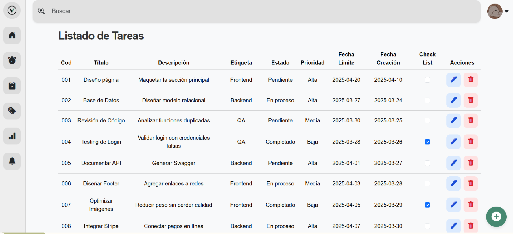
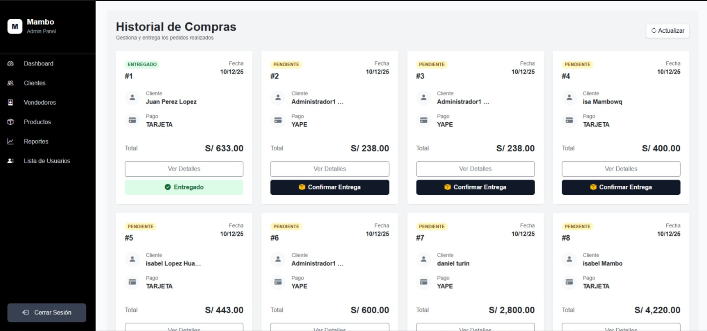

<div align="center">
   
</div>

<h3 align="center">
  Hola, soy Isabel Lopez H.
  
</h3>

<p align="center">
  <a href="https://github.com/DenverCoder1/readme-typing-svg">
    
  </a>
</p>


<!-- Acerca de mi -->

<hr>

```
github.com/Isabelopez02
-------------------------
💻 Desarrolladora de Software enfocada en sistemas web  
🧩 Full Stack Developer (Frontend & Backend)  
🛠️ Experiencia con Angular y Spring Boot  
🌐 Desarrollo de APIs REST e integración con bases de datos  
🌱 En constante aprendizaje  
🚀 Creando aplicaciones web funcionales y escalables  
```
<hr>


<div >
  
## Tecnologías usadas

<!-- Tech stack using skillicons.dev -->
<a href="https://skillicons.dev">
  
</a>

</div>

---
<h2>Trabajos :octocat:</h2>

<p align="center">
<table align="left">
<tr border="none">

<td width="50%" align="center">
  
</td>

<td width="50%" align="center">
  
</td>

</tr>
</table>
</p>

<!-- Analisis de dashboard -->


---

## Estadísticas de GitHub

<div align="center">


</div>

---

<!-- Redes -->

<div align="center" style="margin: 20px 0;">

[](https://github.com/Isabelopez02)
[]()
[](https://tusitio.com)

</div>


<hr style="border: 0; height: 1px; background: #30363d; margin: 10px 0;" />

<small> *El código es poesía, cada línea cuenta una historia*</small> <br>
<small> *Última actualización: Noviembre 2023* </small>
